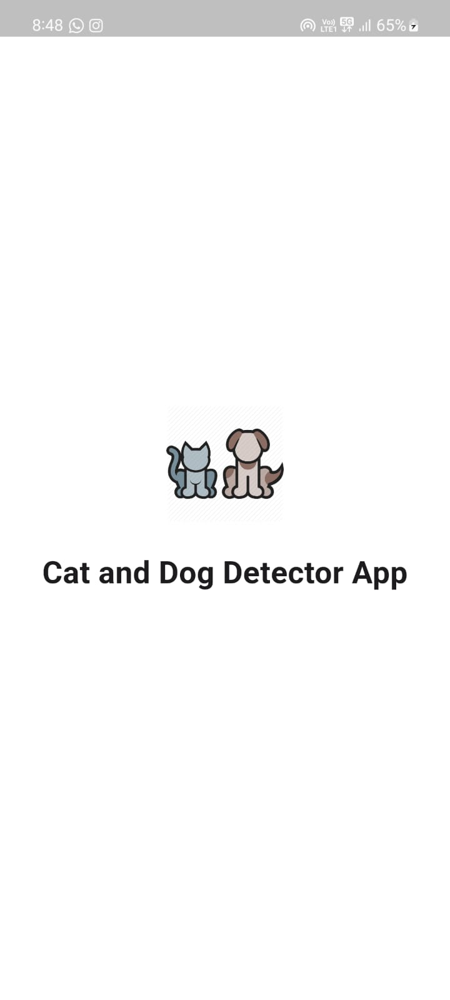
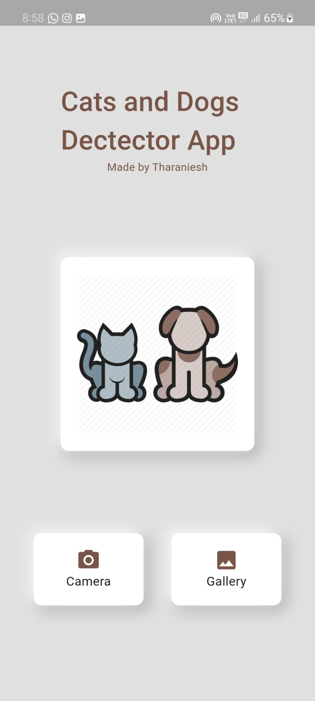
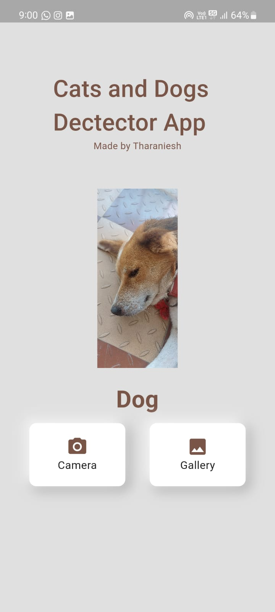
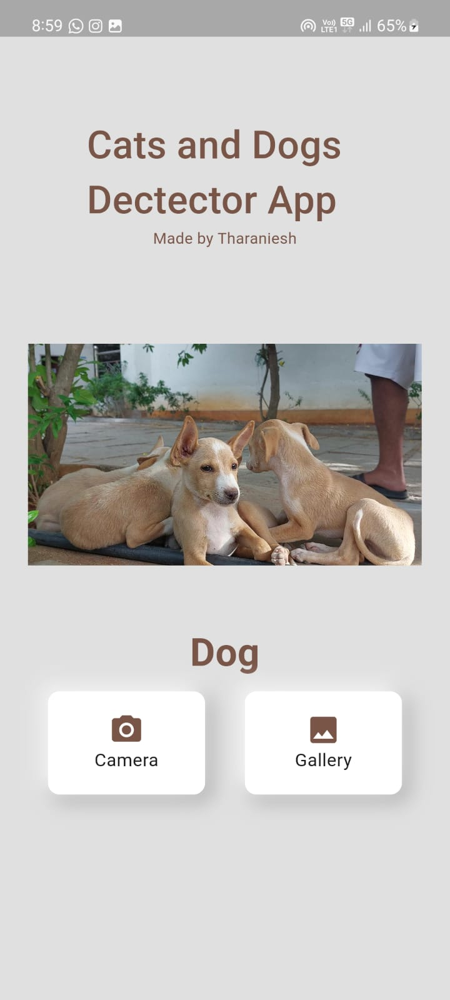

# cat_vs_dog_identifier

# GREENPLANET
### Heyyo Iam [Tharaniesh](https://www.instagram.com/__thaxx__/). I have made a application which classifies whether the object in the image is a dog or a cat.I made this using flutter and tflite.
Have a look on it.
## THIS IS HOW IT LOOKS LIKE
 
 
 
 
  
## <u>Social Profiles</u> :
[Instagram](https://www.instagram.com/__thaxx__/)
 
 
[Twitter](https://twitter.com/_Tharaniesh_)
 
 
[Github](https://github.com/Tharaniesh3/)
 
 
[Linked In](https://www.linkedin.com/in/tharaniesh-p-r-1429a3171/)
 
 
[Email ID](mailto:www.tharanieshmarvel@gmail.com)
  
 
[Click Here To Know More👈](https://tharaniesh3.github.io/website/)
